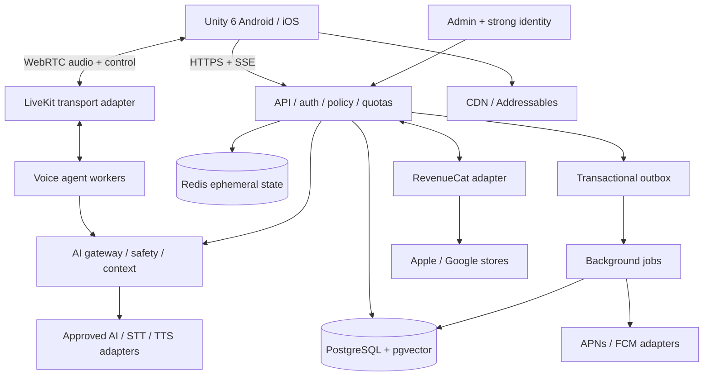

# Architecture and boundaries

## ARCH-01 — initial deployment

Use a modular monolith API plus background worker and independently scalable realtime voice workers. Proposed reversible local stack: ASP.NET Core on a supported LTS .NET release, PostgreSQL/pgvector, Redis, React/TypeScript admin, containerized local dependencies. Choose and pin exact supported releases in M0. Python voice workers are acceptable where the selected voice-agent SDK has stronger support; isolate behind shared contracts. Managed cloud products and regions require Q-007 approval.

The AI gateway is a logical server module, not a required additional network service. The voice control plane handles authorization, session leases, spend reservations and context; audio uses the realtime transport, not REST polling. The backend remains authoritative for identity, entitlements, inventory, memory and usage. A client can animate locally but cannot grant rights or set safety policy.

## ARCH-02 — boundaries and durable flow

Modules: Identity, Companions, Conversations, AI, Memory, Catalog, Commerce, Assets, Notifications, Safety, Administration and Telemetry. Each owns domain rules; access another module through an application interface/event, not untracked table writes. Use transactional outbox for committed side effects and idempotent consumers; assume at-least-once delivery. Redis caches are disposable, not the only source of paid quota, purchases or messages.

Text flow: authenticate → authorize conversation → reserve quota → persist accepted user message/job and outbox in one transaction → input policy → assemble approved context → call provider → moderate output according to delivery policy → stream accepted deltas → persist canonical response and settle usage → emit completion. Failures produce a terminal state and release unused reservation. Safe replay comes from persisted events/canonical state, not restarting an unknown provider call.

Voice flow: backend authorizes a server-named room and bounded session → worker loads authorized context → media and turn control proceed through adapter → interruption updates actual played history → durable turn and usage checkpoints → final reconciliation. Provider session history is never the sole record.

## ARCH-03 — scale evolution

Begin in one approved region with multi-zone managed database where funded, managed Redis, object storage/CDN and managed container services. Add replicas and worker pools based on latency/queue measurements. Extract services only when independent capacity, deployment or ownership is demonstrably constrained. Do not begin with Kubernetes, Kafka, service mesh, database-per-user or active-active writes.

Acceptance: local mock slice runs without external accounts; API/worker restarts lose no accepted text/purchase jobs; loss of Redis does not lose purchases; provider and transport swaps do not change Unity domain APIs; capacity roadmap distinguishes registered users, MAU, DAU and simultaneous calls.
