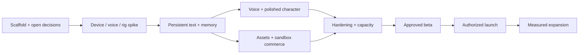

# Phased implementation plan

Implement complete vertical slices and demonstrate them. Durations depend on staffing/assets/accounts and are not promised here. A milestone is complete only when its exit evidence exists. Missing human/device/provider work is explicitly blocked, not deferred invisibly into launch.

## Current owner priority — 2026-10-02

First deliver and verify a playable portrait Unity Editor scene with the supplied
character, actual generated replies, spoken audio and facial expressions. Defer further
Android builds until the Editor conversation works. Use already-installed local inference
and Windows speech as a reversible development adapter; this does not select a shipping
provider or reduce the bilingual/mobile acceptance criteria below. Editor window layout
and Simulator selection remain preserved. As of 2026-10-03 the local prototype supports
typed input, reviewed English microphone transcription, incremental sentence speech,
New chat, setup diagnostics and remembered microphone selection. Stop/Retry context
keeps only completed exchanges. Physical microphone quality, Hindi speech and native
mobile transport remain subsequent work; local checks do not close M1 device gates.

| Milestone | Deliverables / entry dependencies | Exit criteria | Human gate |
|---|---|---|---|
| M0: clarify and scaffold | Read specification, inspect repo, initialize QUESTIONS/STATUS/ADRs, typed contracts, local dependencies, mock providers, CI; portrait-first Unity bootstrap | Fresh checkout runs a labeled portrait mock chat with visible placeholder avatar; loading/cancel/retry/error controls fit narrow phones; schemas validate; no external spend | Q-001..003 answered; portrait direction confirmed; queue other decisions by dependency |
| M1: mobile feasibility | Unity/native voice integration spike, chosen device matrix, facial diagnostic rig, provider capability/cost ADR | Android+iOS IL2CPP devices prove audio routing, interruption, lip sync and measured resource/latency budgets; dependency versions pinned | Devices, licensed rig, approved limited provider spend/credentials; Q-004/006/010 |
| M2: persistent text vertical slice | Auth, profiles/companions, conversations/SSE, quota ledger, policy pipeline, memory CRUD/retrieval, reporting and deletion foundations | Cross-device text/history works; replay/isolation/memory correction/deletion tests pass; no secrets on client | Identity and real-data terms/region/retention before external users |
| M3: production voice and character quality | Real voice worker, session leases, barge-in, audio-clock visemes, personality/emotion, context invalidation | Both platforms pass voice failure matrix and AI evals; active call memory deletion tested; orphan billing bounded | Approved voice architecture, limits and policy |
| M4: wardrobe and sandbox commerce | Asset validator/CDN pipeline, store UI, equip/inventory, RevenueCat, restore/refund/reconcile | All shipping avatar/outfit combos approved; sandbox edge cases and catalog rollback pass | Store accounts, product/rights/pricing and transfer decisions |
| M5: operational hardening | Admin/RBAC/audit, push, analytics/alerts, security review, accessibility, IaC, load/restore/runbooks | P0 automated/device suites pass; RPO/RTO/capacity/cost evidence; operators rehearse incidents | Cloud budget, operator/support/legal ownership |
| M6: closed beta | Real signed distribution, approved consent/policies, capped cohorts, support/report operation | Agreed beta cohort/time yields quality, safety, reliability and cost gates; no Sev0/Sev1 bugs | Explicit beta authorization and legal/store review |
| M7: public launch | Launch checklist, store assets/review account, phased rollout and rollback readiness | Authorized stages pass measured gates; launch monitoring and reconciliation staffed | Explicit store publication/production authorization |
| M8: evidence-led expansion | New locales/avatars, provider fallback, capacity optimizations | Each addition passes same safety/device/eval/economic gates | Fresh business/legal/vendor scope as needed |

### Owner-requested Alita-only polish (2026-10-05)

Supersedes the earlier three-character expansion. Only Alita remains in the talking and
diagnostic scenes. Original/Cosmos imports and GUIDs are archived outside Assets, with
source exports preserved. Portrait/material polish, exact runtime facial subsets and
batched morph updates are implemented; short desktop Editor performance comparisons and
mesh/face validation passed. Next character work: mobile LOD/material consolidation and
physical resource/thermal/AV tests. Keep the production targets below unchanged.

### Owner-requested Meera character (2026-10-08)

Supersedes the Alita-only roster for the local prototype: the owner-supplied Tripo character
is rigged in Blender on the CC_Base convention and runs on the existing idle/IK, gaze, viseme,
expression, wardrobe and lifecycle systems, plus new spring physics for hair, earrings and
cloth. Alita remains default; a Settings picker switches appearance only. See ADR-071 and
evidence/m1/meera. Production roster (Q-016), rights (Q-010), sculpted face polish and
mobile LOD/device budgets remain open; the production targets below are unchanged.

### Mobile lifecycle continuation (2026-10-07)

UNITY-02/UNITY-03 now include explicit suspension of local requests, capture, speech,
character updates and portrait camera; draft-preserving resume with no automatic restart.
Contextual navigation-cancel backs out of overlays and unsaved wardrobe previews.
20 lifecycle and 56 portrait Editor checks passed. Native permission/audio focus,
Android Back/IME, process-death policy and physical-device evidence remain pending.
M1 remains partial; no provider or real-data policy decision is implied.

### Microphone permission continuation (2026-10-07)

UNITY-03 permission adapters and explanation/denial/settings UI implemented. Background
or Back cancels pending UI; grant requires another mic gesture. Android generated
manifest metadata and iOS purpose configured. 16 Editor fake-adapter/build-transform
checks passed. Native build/device validation and full audio-focus/session integration
remain pending; the Windows speech adapter is not a mobile voice transport.

### Progressive local response continuation (2026-10-07)

Owner-requested progressive text + sentence voice now overlap local model generation.
Truthful Local AI typing/online/speaking/last-seen states use session-only observations.
126 decoder, actual service, live UI, replay, portrait and lifecycle assertions passed.
This advances the responsive Editor interaction slice; native mobile transport, approved
production providers and streaming safety policy remain pending. See ADR-065.

### Full-screen transparent overlay revision (2026-10-07)

Owner replaces the separate chat drawer with a transparent scrollable overlay below
navigation. The full-body scene is independent of chat/keyboard/wardrobe layout, so it
no longer zooms to accommodate conversation height. Update layout acceptance accordingly;
retain portrait, safe-area, scrollback, full-body framing and keyboard reachability checks.
See ADR-066 and evidence/transparent-chat. Physical IME/readability QA remains pending.

## PLAN-01 — critical dependency order

2026-10-04 implementation update: owner requests progress toward production. M1 remains
partial; proceed with independent M2 synthetic database work while device/provider gates
remain open. PostgreSQL account-conversation admission/RLS/outbox foundation is implemented
and tested locally. Terminal transitions and database-local status-consumer dedupe are
also implemented, followed by configurable quota reservation/settlement (34 database
groups total). A loopback synthetic-account API now provides atomic quota/admission and
owner-scoped turn lookup (23 actual HTTP checks). Migration 005 now adds atomic terminal reply/outbox/usage settlement through a trusted
worker database entry. Migration 006 and a bounded local synthetic worker now implement
claim/renew/reclaim and fenced completion. Migration 007 adds durable bounded JSON event/message replay and
cancellation fencing. The local account API now also streams persisted events through
bounded SSE with Last-Event-ID reconnect (53 database/worker groups + 47 HTTP checks).
A session-only .NET synthetic history client now validates hydration and bounded reconnect
with 13 additional checks. A separate Unity-compatible projection/UnityWebRequest adapter
now passes 10 stopped-Editor socket checks. An opt-in vertical history screen also passes
8 checks against actual PostgreSQL/API; full --api --unity harness has 114 passed groups.
Development runtime history navigation now passes 13 offscreen portrait/layout checks;
missing-fixture captures inspected. Six-turn populated runtime history and 150% message
text now pass 16 checks at 360x640, with normal/large/scroll-bottom captures inspected.
Runtime reconnect/auth-failure recovery now passes 12 controlled socket checks; full actual
API harness and Editor regressions remain green. Retained cards and keyboard navigation
now pass 13 runtime checks at 1000 turns; warm detached rendering measured and improved.
Variable-height virtualization now passes 15 runtime checks with <=32 bound cards at
1000 turns; populated runtime/API regressions pass.
Next: device/accessibility history QA,
approved production identity,
external provider/worker lifecycle and portrait account/history flows. Q-011 is answered:
guest trial, account for saved history/purchases. Guest data migration/retention/limits,
external identity and production data handling require their remaining decisions.

Independent modules may proceed while a provider question is pending. This is a work dependency diagram, not permission to create external agent tasks/accounts or run paid work. Make deliberate scope cuts before public launch only through product approval and updated requirements, not by leaving half-working features visible.

## PLAN-02 — first implementation backlog

1. Create local mock bootstrap and visible dev-mode marker; establish contracts/ADR templates.
2. Implement a portrait-first screen skeleton, visible placeholder avatar above chat, and fake text stream with cancel/replay/error. Keep composer and recovery controls reachable on narrow phones; put mock settings in a separate panel.
3. Define shared rig/viseme diagnostic fixtures; exercise facial mixer with recorded synthetic audio.
4. Prove native Unity voice SDK with physical devices; record supported versions and failure modes.
5. Build durable user/conversation/turn/outbox/quota schema and auth boundaries using fake identity locally.
6. Connect approved real identity/provider only after setup gates; validate schema and redaction.
7. Finish each milestone's adverse cases and evidence before broadening feature scope.

Acceptance: STATUS tracks requirement IDs, tests, human dependencies and concrete next task; a demo is never substituted for launch readiness; every P0 requirement maps to a milestone and evidence owner.

## PLAN-03 — portrait correction (owner requested 2026-09-26)

The mobile application is portrait-only. This replaces the M0 desktop two-column layout
and narrow-screen avatar hiding. Retain the same Unity project, scene GUID and mock domain.

- M0: set portrait orientation/default preview, width-based UI scaling, a vertical avatar/chat
  layout, bounded scrolling transcript, fixed composer/actions, persistent mock disclosure,
  safe-area insets and keyboard-aware compaction. Use a collapsible overlay for demo controls.
- M0 evidence: Editor captures at 360×640, 390×844 and 1080×1920; verify character and primary
  controls remain visible, long messages scroll, and simulated notch/home/keyboard insets
  leave the composer reachable. Rerun loading/stream/failure/cancel/retry checks in portrait.
- M1: physical Android/iPhone portrait lock, actual soft keyboard/IME resize, notches,
  gesture navigation, background/resume and English/Hindi input. Editor simulation cannot
  approve these. Device matrix Q-004 and provider/asset gates remain unchanged.
- M2–M5: all mobile flows (onboarding, voice, memory, wardrobe, purchases, settings) follow
  the same portrait shell and undergo large-text and screen-reader verification.
- Admin remains a separate web application; this mobile orientation decision does not
  constrain its layout. Existing API-policy and clean-import verification gaps remain explicit.
